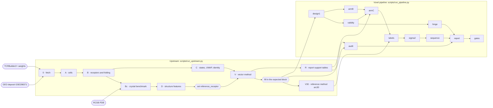

# NOODLE — Neighbourhoods Of Oriented Domain Loop Ensembles

A voxel-grid descriptor of T-cell receptor predicted structure

Compare predicted αβ T-cell receptor structures as 3D grids of occupancy and chemistry, cluster them, test the clusters
against per-cell labels (for example transcriptional state), cross-check them against sequence similarity (tcrdist3), and
publish the whole thing as a self-contained interactive HTML report.

It runs end to end, from a public 10x VDJ + gene-expression + hashtag deposit (GEO GSE298371) to the reports: cell QC and
states, receptor folding with TCRBuilder2+, a crystal benchmark, frames and landmarks, a vector reference method, and the
voxel descriptor itself. It ships as a **Claude skill** (`SKILL.md` plus `references/`, so an agent can run and extend the
method correctly) and as a **plain pipeline** you can run from the command line. No data, models, weights or results are
included.

All code and packaging was written by Claude Opus5 & 5.5. 

## Pipeline at a glance

<!-- flowchart:start -->


The interactive version, with every step, its script, environment, inputs, outputs and the command to run it alone: [`docs/flowchart.html`](docs/flowchart.html) (open the file locally; it needs no network). Both are generated from the runners and the step scripts; regenerate them after changing a runner.
<!-- flowchart:end -->


### Example report 

Analysed GEO dataset GSE298371 under releases.

## What it does

**Upstream** (`scripts/run_upstream.py`, details in `references/upstream.md`): fetch the GEO files and the TCRBuilder2+
weights (sha256-checked); demultiplex hashtags and QC the cells; build paired V domains and fold them (TCRBuilder2+ via
ImmuneBuilder, OpenMM refinement); build a crystal benchmark from the RCSB PDB; map transcriptional states (Scanpy,
Harmony, Leiden) and a UMAP; extract CDR3 atoms, a shared framework frame, framework landmarks and TCR-intrinsic axes;
run the vector method and the arc30 reference method; write the report's sequence, CDR3-origin and gene-expression
tables.

**Voxel pipeline** (`scripts/run_pipeline.py`, details in `references/pipeline.md` and `references/method.md`):

1. **Frame.** Each chain is fitted on five framework landmarks (IMGT 23, 41, 89, 104, 118) onto the same chain of a fixed
   reference model, then placed on TCR-intrinsic axes, so every loop sits in the same place relative to its own chain.
2. **Grid.** Heavy atoms of the chosen loops (all four loops, or CDR3 only) are smeared as Gaussians (σ, default 2.0 Å)
   onto 1 Å voxels in frozen per-chain boxes, in seven channels: occupancy, hydrophobic, aromatic, H-bond donor, H-bond
   acceptor, positive, negative. Channels are unweighted; their influence follows the atom masses in the typing table.
3. **Distance.** D² = Σ (a − b)² / h³ over both chain boxes and the seven channels, by a blocked Gram matrix in float64.
   It splits exactly into 14 non-negative parts (2 chains × 7 channels), which the report shows per cluster member.
4. **Clusters.** Threshold = the 1st percentile of the distance over a fixed set of random receptor pairs; complete
   linkage, so every pair inside a cluster is within the threshold; singletons dropped.
5. **Validation.** A crystal benchmark panel: how much crystal-verified structure the descriptor recovers from predicted
   models beyond sequence similarity (partial Spearman), beyond a reference descriptor, and how reliable a model is
   against its own crystal — with bootstrap intervals over receptors.
6. **Label test.** Cluster purity against a permutation null ladder (free, within donor, within donor + V-gene pair,
   + CDR3 length class), a per-cluster one-sided binomial, and Benjamini–Hochberg correction.
7. **Sequence cross-check.** An independent tcrdist3 partition built with the same threshold rule, so each structural
   cluster is labelled *also* / *partly* / *not* a sequence cluster.
8. **Report.** One HTML file (plus a data folder) with an overview, methods, validation, a worked example, a cell UMAP,
   the cluster list and a page per cluster: 3D loops with side chains **and the superimposed voxel grids**, the exact
   distance split, the IMGT alignment, and the sequence cross-check with a pairwise heat map.

Every voxel stage writes a checks file and stops on failure (upstream steps stop on a non-zero exit). The report has
its own gates: the data in the page are read back and compared with their source files, clusters are recomputed independently, and the grids drawn in the browser are
checked against the Python build.

## Requirements

- Six conda environments in `environments/`: `tcr-fold.yml` (folding, numbering, crystal benchmark: ImmuneBuilder,
  PyTorch CPU, OpenMM, pdbfixer, ANARCI, HMMER), `sc-gex.yml` (cells, states, UMAP, gene files: Scanpy, anndata,
  harmonypy, leidenalg, umap-learn, h5py), `analysis.yml` (structure features, vector method, most table steps),
  `main.yml` (voxel stages and report; can also serve as `analysis`), `tcrdist3.yml` (sequence cross-check; parasail
  from bioconda) and `stcrpy.yml` (optional hinge module).
- `node` for the report's syntax check and the grid gate.
- Network: GEO and the ImmuneBuilder weight URLs (stage 0), RCSB (stage Bc). Everything else runs offline.

```bash
conda env create -f environments/tcr-fold.yml
conda env create -f environments/sc-gex.yml
conda env create -f environments/analysis.yml
conda env create -f environments/main.yml
conda env create -f environments/tcrdist3.yml
conda env create -f environments/stcrpy.yml      # optional
```

## Quick start

```bash
cp config/voxel_config.example.json config/voxel_config.json
#   set project_root, the interpreter of each environment in "envs", and the "report" block;
#   "upstream.dataset_config" points at config/upstream_gse298371.json (the worked example)
python scripts/run_upstream.py --list                  # stages 0 A B Bc C D V V30 R
python scripts/run_upstream.py --stage all --dry-run   # every command, nothing run
python scripts/run_upstream.py --stage 0,A,B,Bc,C,D     # public data -> models, benchmark, states, frames
#   set reference_receptor to the medoid named in the v2_d2_frame_and_atoms log (stages V and V30 read it)
python scripts/run_upstream.py --stage V,V30,R         # vector and reference methods, report support tables
#   set the "expected" block from this run's outputs (references/inputs.md)
python scripts/check_inputs.py                         # read-only: what is present, what is missing
python scripts/run_pipeline.py --list                  # voxel and report stages, in order
python scripts/run_pipeline.py                         # voxel stages, then the reports and their gates
python scripts/checks_summary.py                       # every checks file, failures flagged
```

A run stops at the first failed check. To continue past a failure you have already reported and recorded as an expected
outcome, list it under `documented_failures` in the config and pass `--accept-documented` (`references/pipeline.md`).

`python pipeline/code/fetch_geo.py --check-remote` compares the remote GEO file sizes with the expected ones (one HEAD
request per file, nothing downloaded). All paths come from `config/voxel_config.json`; the code refers to logical
prefixes (`structures/`, `landmarks/`, …) that the config maps onto your directories. `run_upstream.py` creates the
standard folders in a fresh write root and `run_pipeline.py` does the same for the voxel output folder. Nothing is
hard-coded to a machine. For your own data, start from `config/upstream.example.json` and read `references/inputs.md`
first: several choices were made for GSE298371 and must be made again.

Open a report locally (do not serve it publicly if your data are unpublished):

```bash
cd <your voxel out dir>/report && python3 -m http.server 8765 --bind 127.0.0.1
```

## Time and disk

- Downloads: about 170 MB of GEO files, about 1 GB of weights.
- Folding: about 75 min per 1,000 receptors on 10 CPU cores; about 0.27 GB of models per 1,000 receptors. Folding is
  resumable (models already on disk are skipped).
- Voxel stages: roughly 10–20 min per arm for the grids and a similar time for the distances on 8 cores for a
  ~10,000-receptor repertoire. `run_pipeline.py` deletes each grid after its last reader, so peak scratch is about
  60 GB (largest grid about 36 GB, plus the kept distance matrices of about 0.4 GB each); `"keep_grids": true` keeps
  them (about 180 GB). Rerunning a single grid-reading stage later needs its grid rebuilt first
  (`references/pipeline.md`).

## Reproducibility

- Stages 0, A, B (apart from folding) and R reproduce exactly.
- Folding is not deterministic. The network prediction reproduces bit for bit, but OpenMM refinement does not: refolded
  models differ from earlier ones by a median Cα RMSD of about 0.15 Å (CDR3 about 0.5 Å), occasionally more. A full
  refold will not reproduce the downstream numbers of an earlier run exactly. The crystal benchmark also folds, so a
  rebuilt benchmark can accept a different set of pairs. Fold once, keep the models and the benchmark, and reuse them.
- Across machines, last-bit float differences (about 1e-11 Å) can renumber cluster ids in the vector method without
  changing any cluster; compare clusters by member set (as arc30 gate G4 does). The UMAP layout depends on the software
  versions; cells, states and clusters do not. The float64 columns of the arc30 G3 reference table (`ARCN3_mode_metrics.csv`) reproduce to about 1e-15, not
  bit for bit.

Details: `references/upstream.md` → Reproducibility.

ANARCI needs `hmmscan` on `PATH`; both runners put each environment's `bin/` first on `PATH`. The fold step exits
non-zero if a shard or the recovery fails or a failed model is left.

## Documentation

| file | contents |
|---|---|
| `SKILL.md` | the agent-facing skill: when to use it, working rules, how to run and extend |
| `references/upstream.md` | the upstream stages 0–R: scripts, outputs, environments, run time, reproducibility, pitfalls |
| `references/method.md` | every parameter: frame, boxes, channel masses, blur, distance, threshold, panel, label test, tcrdist3 |
| `references/pipeline.md` | the voxel stages in run order, inputs → outputs, dependencies, run times |
| `references/report.md` | report configurations, build steps, gates, templates, pitfalls |
| `references/inputs.md` | external inputs, what each stage produces, the voxel input contract, data-set-specific decisions, bringing your own data |
| `references/extending.md` | how to add an arm or a parameter without breaking the record (pre-registration discipline) |

## Provenance and scope

Developed on public data from GEO **GSE298371** (Ansaldo E, et al. *PNAS* 2026;123(2):e2520747122,
[doi:10.1073/pnas.2520747122](https://doi.org/10.1073/pnas.2520747122)) — mouse CD4 T cells with paired V(D)J and
transcriptomes. **No data and no results from that work are included here**; the package is method and code only, and the
report templates take their data-set label and condition labels from your config.

The method was built under a pre-registered design with amendments: a first whole-molecule design failed its
pre-registered crystal test, and the loop-only and CDR3-only arms, the σ sensitivity arms and the sequence cross-check
were each recorded as amendments before being run. `references/extending.md` keeps that discipline; please keep it if you
extend the method.

## Citation and third-party components

If you use NOODLE, or results produced with it, please cite:

> Rizk, J. (2026). *NOODLE: a voxel-grid descriptor of T-cell receptor predicted structure* (version 1.0) [Computer software]. https://github.com/RizkyBusiness/NOODLE

Also please cite  the methods it builds on — see the reference lists in
`references/upstream.md` (HTODemux, Scanpy, Harmony, Leiden, UMAP, ANARCI, IMGT, ImmuneBuilder / TCRBuilder2+, OpenMM,
Kabsch, Benjamini–Hochberg) and `references/method.md` (voxelised pharmacophore channels, BLOSUM62, adjusted Rand index,
TCRdist and tcrdist3, 3Dmol.js).

The report template inlines **3Dmol.js** (BSD-3-Clause; Rego & Koes, *Bioinformatics* 2015;31:1322–4; licence texts in
`licenses/`). ImmuneBuilder, ANARCI, OpenMM, Scanpy, tcrdist3 and the other dependencies are installed by you and not
redistributed; the TCRBuilder2+ weights are fetched, not redistributed, and their terms are yours to check. See `NOTICE`.

## Licence

MIT — see `LICENSE`.
